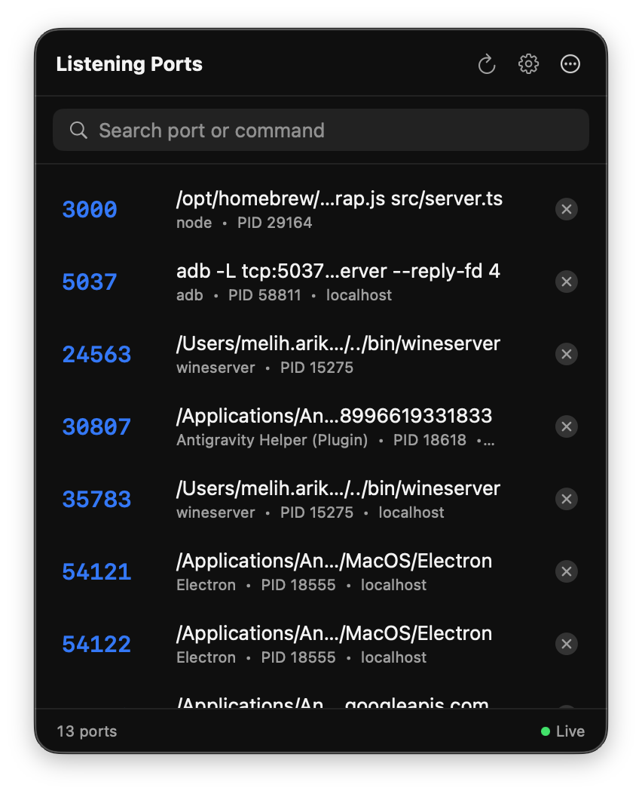

<div align="center">

# portman

**See and reclaim every port on your Mac.**

[](https://github.com/meliharik/portman/actions/workflows/ci.yml)
[](https://github.com/meliharik/portman/releases/latest)
[](LICENSE)
[](#requirements)

</div>

A native macOS menu bar app that shows you which processes are listening on which ports — and lets you kill them with one click. No more `lsof | grep` followed by `kill -9`.

<!-- TODO: add screenshot of the popover -->
<!--
<p align="center">
  
</p>
-->

## Features

- **Live port scanning** — every TCP port your apps are listening on, refreshed every two seconds.
- **One-click termination** — sends `SIGTERM`, then `SIGKILL` if the process doesn't go away.
- **Lives in your menu bar** — no Dock clutter; click the icon at the top of your screen.
- **Quick search** — filter by port number or command name.
- **Context menu** — right-click a row to copy the port, PID, or full command.
- **Launch at login** — toggle in Settings; uses `SMAppService`.
- **Native UI** — built with SwiftUI, uses system materials and Liquid Glass on macOS 26.

## Requirements

- macOS 15.0 (Sequoia) or later
- Apple Silicon or Intel Mac

## Installation

### Download the DMG (recommended)

1. Grab the latest `portman.dmg` from the [Releases page](https://github.com/meliharik/portman/releases/latest).
2. Open the DMG and drag **portman.app** to your Applications folder.
3. Launch it once. macOS may warn that the developer cannot be verified — right-click the app and choose **Open** to bypass this on first launch.

### Homebrew Cask

A community tap is available:

```sh
brew tap meliharik/portman
brew install --cask portman
```

> The cask installs the latest signed DMG release. It does not require Xcode.

### Build from source

```sh
git clone https://github.com/meliharik/portman.git
cd portman
open portman.xcodeproj
```

Then **⌘R** in Xcode. Requires Xcode 16 or later.

## Usage

1. Click the **portman** icon in the menu bar.
2. Browse listening ports — each row shows the port, the launching command, and the PID.
3. Search to filter, or right-click a row for copy options.
4. Click **✕** on a row to terminate that process. portman tries `SIGTERM` first, then escalates to `SIGKILL` after 1.5 seconds if the process is still alive.
5. Open **Settings** (gear icon) for "Launch at login" and other options.

### How port scanning works

portman shells out to `lsof -a -iTCP -sTCP:LISTEN -nP -u <you>` and parses the output. Only your own processes are listed — it does not require admin privileges and does not show other users' processes.

### Why is App Sandbox disabled?

To run `lsof` and send signals to other processes, the app needs to spawn binaries and use `kill(2)` on PIDs outside its own bundle. This is incompatible with the App Sandbox, so portman ships with the sandbox disabled. The build is still code-signed and uses the Hardened Runtime.

## Contributing

Pull requests are welcome. See [CONTRIBUTING.md](CONTRIBUTING.md) for development setup, coding style, and the PR process.

Found a bug or want a feature? Please open an issue using one of the [issue templates](https://github.com/meliharik/portman/issues/new/choose) — they prompt for the details we need to investigate.

## Security

If you discover a security vulnerability, please follow the process in [SECURITY.md](SECURITY.md). Please do not open a public issue for security reports.

## Changelog

See [CHANGELOG.md](CHANGELOG.md) for release notes.

## License

[MIT](LICENSE) © Melih Arık
